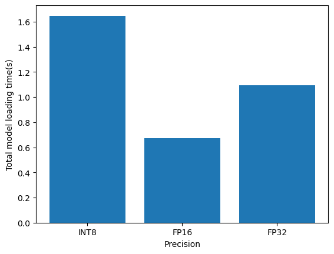
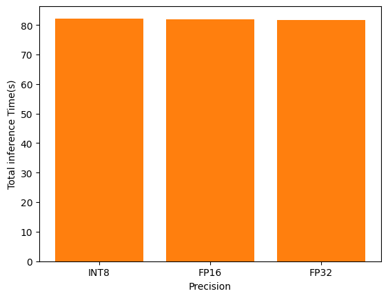
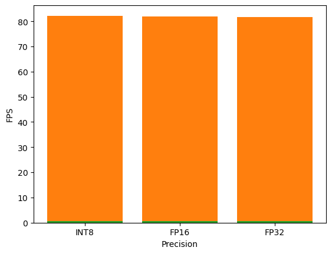

# Computer Pointer Controller

In this project, you will use a gaze detection model to control the mouse pointer of your computer. You will be using the Gaze Estimation model to estimate the gaze of the user's eyes and change the mouse pointer position accordingly. This project will demonstrate your ability to run multiple models in the same machine and coordinate the flow of data between those models.

## Project Set Up and Installation

#### Setup procedure
To work with OpenVINO there are some specific hardware requirements and they are 
- 6th-10th Generation Intel® Core™ processors
- Intel® Xeon® v5 family
- Intel® Xeon® v6 family
- Intel® Movidius™ Neural Compute Stick

#### Project directory structure
```
├───bin
├───helpers
├───logs
├───models
│   ├───face-detection-adas-binary-0001
│   │   └───FP32-INT1
│   ├───gaze-estimation-adas-0002
│   │   ├───FP16
│   │   ├───FP16-INT8
│   │   └───FP32
│   ├───head-pose-estimation-adas-0001
│   │   ├───FP16
│   │   ├───FP16-INT8
│   │   └───FP32
│   └───landmarks-regression-retail-0009
│       ├───FP16
│       ├───FP16-INT8
│       └───FP32
├───results
│   ├───FP16
│   ├───FP32
│   └───INT8
└───src
    └───__pycache__
```
#### Models need to download and where to place them
Before working with this project we need to make sure we have all the model downloaded in our base directory and under models folder.
To do that, first we need to activate OpenVINO by going to the OpenVino installation directory (I am a windows user)
```
cd C:\Program Files (x86)\IntelSWTools\openvino\bin\
setupvars.bat
```

then need to go to 
```
cd C:\Program Files (x86)\IntelSWTools\openvino\deploymentools\open_model_zoo\tools\downloader\
downloader.py --name face-detection-adas-binary-0001 -o ./models
downloader.py --name head-pose-estimation-adas-0001 -o ./models
downloader.py --name landmarks-regression-retail-0009 -o ./models
downloader.py --name gaze-estimation-adas-0002 -o ./models
```

After this copy the `models` folder to your base project directory

#### Installing dependencies
When you are done with above setup then create a virtual environment through conda

```
conda create -n starter_env python=3.7 pip
conda activate starter_env
```

clone the below git repo from [here](https://github.com/bhuiyanmobasshir94/Computer-pointer-Controller)
```
cd Computer-pointer-Controller
pip install -r requirements.txt
```
go to the `src` directory
```
cd src
``` 

## Demo
For INT8:
```
python pipeline.py -fdm face-detection-adas-binary-0001/FP32-INT1/face-detection-adas-binary-0001 -fldm landmarks-regression-retail-0009/FP16-INT8/landmarks-regression-retail-0009 -hpem head-pose-estimation-adas-0001/FP16-INT8/head-pose-estimation-adas-0001 -gem gaze-estimation-adas-0002/FP16-INT8/gaze-estimation-adas-0002 -i "demo.mp4" -o "INT8" -d "CPU" -f fdm fldm hpem gem
```
For FP16:
```
python pipeline.py -fdm face-detection-adas-binary-0001/FP32-INT1/face-detection-adas-binary-0001 -fldm landmarks-regression-retail-0009/FP16/landmarks-regression-retail-0009 -hpem head-pose-estimation-adas-0001/FP16/head-pose-estimation-adas-0001 -gem gaze-estimation-adas-0002/FP16/gaze-estimation-adas-0002 -i "demo.mp4" -o "FP16" -d "CPU" -f fdm fldm hpem gem
```
For FP32:
```
python pipeline.py -fdm face-detection-adas-binary-0001/FP32-INT1/face-detection-adas-binary-0001 -fldm landmarks-regression-retail-0009/FP32/landmarks-regression-retail-0009 -hpem head-pose-estimation-adas-0001/FP32/head-pose-estimation-adas-0001 -gem gaze-estimation-adas-0002/FP32/gaze-estimation-adas-0002 -i "demo.mp4" -o "FP32" -d "CPU" -f fdm fldm hpem gem
```

## Documentation

#### Command Line Arguments
Usage: 
```
python pipeline.py -fdm face-detection-adas-binary-0001/FP32-INT1/face-detection-adas-binary-0001 -fldm landmarks-regression-retail-0009/FP32/landmarks-regression-retail-0009 -hpem head-pose-estimation-adas-0001/FP32/head-pose-estimation-adas-0001 -gem gaze-estimation-adas-0002/FP32/gaze-estimation-adas-0002 -i "demo.mp4" -o "FP32" -d "CPU" -f fdm fldm hpem gem
```

Arguments:
```
-fdm --face_detection_model Path to an xml and bin (without extension) file with a trained model.
-fldm --facial_landmarks_detection_model Path to an xml and bin (without extension) file with a trained model.
-hpem --head_pose_estimation_model Path to an xml and bin (without extension) file with a trained model.
-gem --gaze_estimation_model Path to an xml and bin (without extension) file with a trained model.
-i --input Path to image or video file or camera feed usage direction. For camera feed please pass 'CAM' keyword.
-o --output Output directory name.
-l --cpu_extension MKLDNN (CPU)-targeted custom layers. Absolute path to a shared library with the kernels impl.
-d --device Specify the target device to infer on: CPU, GPU, FPGA or MYRIAD is acceptable. Sample will look for a suitable plugin for device specified (CPU by default)
-pt --prob_threshold Probability threshold for detections filtering" "(0.5 by default)
-f --flags Specify flag with one or more model flags separated by space flags can be used fdm fldm hpem gem like -f fdm or -f fdm fldm etc
```
## Benchmarks
I have done the benchmarking between loading time, inference time and fps with different precision.
#### Loading TIme
  
#### Inference TIme
  
#### FPS
  

## Results
|  Precision	| Loading Time 	        |  Inference Time	    | FPS 	                |
|-	            |-	                    |-	                    |-	                    |
|  INT8	        |  1.6478745937347412	|  82.23121976852417	|  0.7177615571776156	|  	
|  FP16	        |  0.670651912689209	|  81.92747926712036	|  0.7203907203907204	|
|  FP32	        |  1.0919969081878662	|  81.61519622802734    |  0.7230392156862746   |  	


- I got all the precision to act same both on inference time and fps case. FP32 got some higher value for higher precision
- For model loading INT8 took much long time than others and difference is significant

## Stand Out Suggestions
This is where you can provide information about the stand out suggestions that you have attempted.

### Async Inference
If you have used Async Inference in your code, benchmark the results and explain its effects on power and performance of your project.

### Edge Cases
There will be certain situations that will break your inference flow. For instance, lighting changes or multiple people in the frame. Explain some of the edge cases you encountered in your project and how you solved them to make your project more robust.
